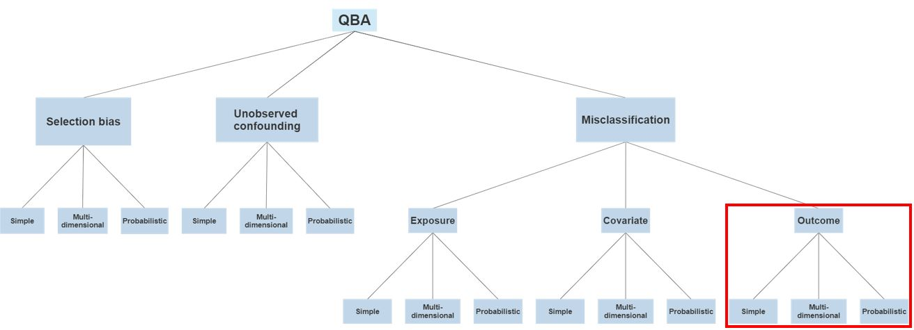
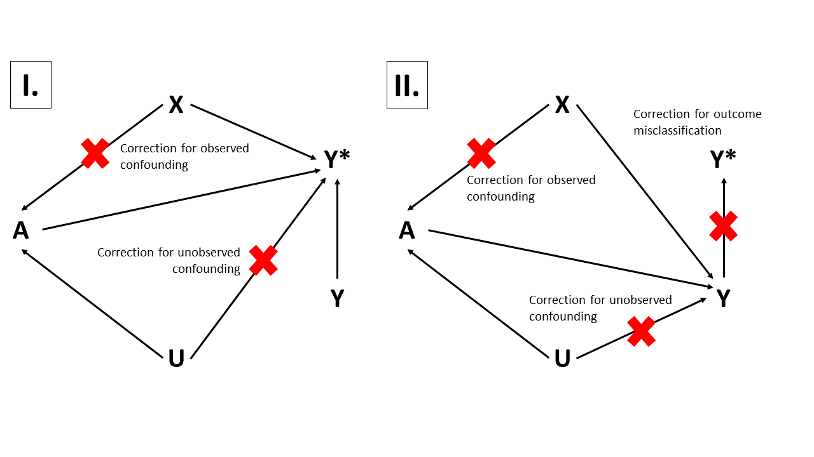

# Background

Randomized-controlled clinical trials (RCT) are the gold-standard for making causal inferences between exposures and outcomes but are resource intensive, slow to execute, lack generalizability, and are under powered for detecting many adverse events. Causal inferences made from the analysis of real-world  data^[In most uses related to research, the term real-world is interchangeable with the term observational. For example, the terms real-world data and real-world research are equivalent to observational data and observational research, respectively. The term observational will be used for the remainder of this document.] (RWD) are of increasing importance for medical decision-making and can be the basis for formulating clinical, policy, and regulatory strategies if properly conducted [@Sherman2016-yn]. Healthcare utilization databases, such as administrative claims and electronic health records (EHR), are a main source of observational data used in pharmacoepidemiologic research. Appropriate analysis of observational data offers the potential to rapidly produce generalizable, precise, real-world evidence (RWE) that accurately reflects the heterogeneity of patient experience in routine clinical care outside the confines of strictly defined experimental conditions[@Stuart2015-gg]. However, RWE validity relies on the extent to which study design and analysis can address the limitations inherent to observational data. Major limitations of observational data include the presence of selective treatment assignment and measurement errors which can manifest as confounding and information biases in results.

Extensive literature is available on methods to correct for observed confounding from selective treatment assignment using exposure propensity scores, many of which have been widely studied, endorsed, and routinely used in observational research using large healthcare databases [@Rosenbaum1983-hi; @Austin2011-we; @Rubin1997-tp; @Franklin2017-fn; @Tian2018-zy]. However, and despite similar availability and endorsement, quantitative assessment of the direction, magnitude, and uncertainty of bias from measurement errors is rarely included clinical studies in epidemiology [@Hunnicutt2016-gn; @Petersen2021-yk]. 

Quantitative bias analysis (QBA) is a set of methods for measuring and correcting selection, confounding, and information biases in observational studies. A prior systematic review covering 2006-2019 [@Petersen2021-yk] found that from over 400,000 publications returned by searching “epidemiology”, there were 697 candidate studies from which 238 were reviewed. The authors conclude that QBA use is rare but increasing, often did not alter results interpretation, the methodology reporting was often incomplete, and the degree of bias correction varied across studies and methods. An earlier, more specific review in pharmacoepidemiology literature found 15 studies[@Hunnicutt2016-gn]. The authors reviewed use of probabilistic QBA and reported that use is rare and methodological approaches and reporting are suboptimal.

The scope of this systematic review is to identify and evaluate observational, pharmacoepidemiology studies intended to estimate the causal effect of a drug exposure on a clinical outcome that used QBA to correct for outcome misclassification. Because this review focuses specifically on QBA for outcome misclassification correction, all subsequent references to QBA will refer to this particular use.

## Description of the problem

Measurement errors typically occur when empirical information is incorrectly recorded in a data source or when there is discordance between a true clinical/biological definition and its operationalization in research. For example, an improperly calibrated continuous glucose monitor may record inaccurate glucose measurements. Further, a clinical definition of type 2 diabetes mellitus as two recordings of fasting blood glucose of ≥126 mg/dL from separate tests is unlikely to be accurately captured in a study that defines patients with diabetes as those for whom the E11.9 ICD-10-CM code is observed. A contemporary example is the ascertainment of coronavirus disease 2019 (COVID-19) cases in administrative claims databases with linkages to laboratory testing information. In many instances, patients with a COVID-19 diagnosis are also observed to have varying patterns of positive and negative COVID-19 testing results temporally proximal to their diagnosis date, which complicates the process of defining case definitions. 

Misclassification can affect exposure, confounder, or outcome measurement which can render study results subject to information bias. In the relatively novel context of distributed observational database network studies, a single clinical outcome definition is generally applied across multiple, disparate data sources where data sources vary widely in terms of intent (e.g., reimbursement, clinical care), data capture process, population coverage, temporal coverage, and content. Given database variability, it follows that measurement error for clinical outcome definitions will vary accordingly and mostly unpredictably.  Therefore, the scope of this review will cover methods for correcting for outcome misclassification.

## Description of the method

This review will investigate a subset of methods for addressing outcome misclassification in pharmacoepidemiologic studies. The focus is on 4 methods introduced by Lash et al[@Lash2009-ch] and all methods require bias parameter information (i.e. sensitivity and specificity or positive predictive value (PPV) and negative predictive value (NPV) as input. The bias parameters can be derived from internal or external validation studies, literature sources, or failing those, expert opinion. Figure \@ref(fig:qbatree) displays a classification tree of QBA methods.

**Simple bias analysis** rearranges the observed distribution of a categorical contingency table of exposure and outcome patient counts to reflect the true distribution were there no misclassification. Algebraic equations that relate effect estimate calculation to the outcome definition bias parameters are used. Standard errors are calculated using the method by Chu[@Chu2006-zo].

**Multidimensional bias analysis** is an extension of simple bias analysis where a range of plausible bias parameters are used as input to produce a corresponding range of misclassification corrected estimates.

In **probabilistic bias modeling**, the bias parameters are selected by drawing from a bias parameter distribution (e.g., uniform, normal, triangular, etc.). The drawn bias parameters are used is input to a multidimensional bias analysis that produced a corresponding distribution of misclassification corrected estimates, where the estimate distribution median could be considered the final, corrected estimate. 

**Multiple bias modeling** incorporates correlated selection, confounder, and measurement bias parameter distributions and is infrequently used in practice[2]. Care must be taken to ensure that implausible bias parameter combinations are not selected to avoid calculating invalid misclassification-corrected estimates.

```{r qbatree, echo=FALSE, message=FALSE, fig.align='center', fig.cap='Schematic of QBA methods classification. This review focuses on simple, multidimensional, and probabilistic methods for outcome misclassification correction highlighted in the red.', fig.pos='H'}
if (knitr::is_latex_output()) {
  knitr::include_graphics("qba_tree.pdf")
} else {
  
}
```

## Intent of the method under review

Applying QBA can quantify the direction, magnitude, and uncertainty of systematic error that results from outcome misclassification and correct for it in an estimate of the causal effect of an exposure on an outcome. A popular heuristic rule states that outcome misclassification that is non-differential with respect to exposure status will bias estimation results towards the null, although in practice this is an unreliable assumption[@Funk2014-bk; @Lash2014-jd]. Rather than relying on heuristics, QBA for outcome misclassification correction attempts to replace the measured outcome occurrence with the true outcome occurrence in a causal analysis (Figure \@ref(fig:dag)). The direction of bias owing to outcome misclassification results from its dependence and differentially with respect to the exposure[@VanderWeele2012-ua].

```{r dag, echo=FALSE, message=FALSE, fig.align='center', fig.cap='Directed acyclic graph depicting a simplified causal structure for assessing the effect of A on Y with correction for observed confounding, unobserved confounding, and outcome misclassification. A: exposure, Y: true outcome, Y&ast;: measured outcome, X: observed confounders, U: unobserved confounders, A &rightarrow; Y&ast;: target association of inference subject to information bias, A &rightarrow; Y: target association of inference, A &leftarrow; X &rightarrow; Y: observed confounding, A &leftarrow; U &rightarrow; Y = unobserved confounding, Y &rightarrow; Y&ast;: outcome misclassification. This scenario assumes exposure and observed confounders are accurately measured and that outcome misclassification is independent and non-differential with respect to exposure status. Panel I depicts the causal structure before outcome misclassification correction. Panel II depicts the causal structure after outcome misclassification correction.', fig.pos='H'}
if (knitr::is_latex_output()) {
  knitr::include_graphics("dag.pdf")
} else {
  
}
```

## Rationale for this review

The existing empirical literature generally reports results from one exposure comparison, for one outcome, in one database, using one QBA type. Evaluating QBA performance is subject to variability from different research questions, study designs, analytic implementations, in contexts where there is no *a priori* expectation about the true result. This review will determine whether novel QBA methodological research should be designed using strictly consistent study design, and analytic implementation, and applied to research questions where the estimates that are expected to be null (i.e., negative control exposure-outcome pairs).

# Review question
What is the performance of quantitative bias analysis (QBA) for outcome misclassification correction in observational, causal effect estimation studies pharmacoepidemiology?

## Objectives

* Characterize use of QBA for outcome misclassification correction in pharmacoepidemiological literature. We will report the number of studies that include QBA methods by year. We will report the proportion of QBA studies by study characteristics [Section XX.X][Study characteristics] and by QBA characteristics [Section XX.X][QBA characteristics]. 
* Assess the impact QBA for outcome misclassification correction on effect measure estimates
* Explore study characteristics and QBA characteristics that may explain impact

# Methods

## Sources to identify studies

* Systematic review registries
* Cochrane Database of Systematic Reviews
* Cochrane Methodology Register
* PROSPERO register
* Bibliographic databases
  + MEDLINE via PubMed
  + EMBASE
  + Web of Science/Web of Social Science
* Reference lists of review articles
* Articles that cite seminal QBA literature

## Search dates
2021-11-01 to <mark>YYYY-MM-DD</mark>

## Restrictions

* Human studies
* English language
* Publication period: 2006-01-01 to <mark>YYYY-MM-DD</mark>

## Scientific domain
Observational, causal effect estimation studies pharmacoepidemiology. Studies intended to estimate the causal effect of a therapeutic exposure on an outcome.

## Study inclusion criteria

We will query the literature for clinical and methodological studies that used validation study results as QBA input to generate effect estimates corrected for outcome misclassification. We will not restrict studies to any specific therapeutic area, study design, data type, or QBA approach. We will only require that the clinical studies were intended to estimate the causal effect of a therapeutic exposure on an outcome using observational data and include effect estimates with and without QBA-based correction. Methodological studies must be intended to assess a method for outcome misclassification correction in studies with this same intent. Methodological studies could be based on empirical or simulated data.

### Participants/population
No restrictions on patient population or therapeutic area.

### Intervention

4 types QBA for outcome misclassification correction from Lash (2009)[@Lash2009-ch]

* Simple
* Multidimensional
* Probabilistic
* Multiple bias modeling (correlated biases)

### Comparator
No QBA for outcome misclassification correction

### Types of studies to be included
* Cohort
* Case-control
* Self-controlled
* Methodological (empirical or simulated)

## URL to search strategy

<mark>Search strategy for each source here</mark>. Searches will be rerun prior to final analysis.

## Main outcomes
* **Bias difference**, defined as the difference between the log of the QBA-corrected effect estimate and the log of the uncorrected estimate)
  + log(nonQbaEstimate) – log(qbaEstimate)
* **Relative bias**, defined as the percent difference between the QBA corrected effect estimate and the uncorrected estimate)
  + [nonQbaEstimate – qbaEstimate] / nonQbaEstimate * 100

## Additional outcomes
* **Squared error**, defined as a directionless quantity representing only the magnitude of bias correction
  + [log(nonQbaEstimate) – log(qbaEstimate)]^2^
* **Precision difference**, defined as the difference in the precision of the QBA-corrected point estimate and the uncorrected estimate)
  + 1/(SE(log(nonQbaEstimate))^2^ – 1/(SE(log(qbaEstimate))^2^
* **Coverage**, defined as whether the confidence intervals (CI) of the QBA-corrected and uncorrected estimates include the null

## Study selection
Two reviewers (JW and <mark>??</mark>) will independently apply eligibility criteria to the de-duplicated set of studies identified by the search strategies and will be blinded to decisions of the other reviewer. Included study discrepancies will be adjudicated by a third reviewer (DPA).

## Data extraction

Two reviewers (JW and <mark>??</mark>) with independently extract data from included studies. Data extraction discrepancies will be adjudicated by a third reviewer (DPA). Data will be collected in a <mark>data collection tool</mark>. Missing data will be allowed. Study authors will be contacted if data are missing for main or additional outcomes.

The following data will be extracted from each included study. A single study can contain ≥1 effect estimates so there can be ≥1 row of data collected per study. The unit of analysis of this review is each effect estimate, grouped at a second level by study.

### Study indentification
* First author (text)
* Year published (numeric)
* PMID, if available (numeric)

### Outcomes
Extracted effect estimates will be those adjusted for any other forms of bias(e.g. PS matching)

* QBA-corrected log effect estimate (numeric)
* QBA-corrected log standard error of effect estimate (numeric)
* QBA-uncorrected log effect estimate (numeric)
* QBA-uncorrected log standard error of effect estimate (numeric)
* QBA-corrected exp effect estimate (numeric)
* QBA-corrected exp standard error of effect estimate (numeric)
* QBA-uncorrected log effect estimate (numeric)
* QBA-uncorrected log standard error of effect estimate (numeric)

### Study characteristics
The following data will be extracted if applicable and available. Target, comparator, and outcome counts will be those reported after all study design restrictions implemented.

* Study type (categorical):
  + Clinical
  + Methods
* Design (categorical), if Study type = Clinical:
  + Cohort
  + Case-control
  + Self-controlled
* Design (categorical), if Study type = Methods:
  + Empirical
  + Simulated
  + Quasi-simulated
* Target definition (text)
* Target N (numeric)
* Comparator definition (text)
* Comparator N (numeric)
* Time-at-risk definition (text)
* Target time-at-risk days (numeric)
* Comparator time-at-risk days (numeric)
* Additional bias correction approaches (multiple choices categorical)
  + QBA for exposure misclassification
  + QBA for covariate misclassification
  + QBA for unmeasured confounding
  + QBA for selection bias correction
  + PS matching
  + PS stratification
  + Multiple regression outcome modeling
  + Negative control assessment
  + Other
* Outcome model and estimator (categorical)
  + Logistic regression/OR
  + Poisson regression/RR
  + Cox PH regression/HR
  + Other
* Distributed database network study (categorical)
  + Yes
  + No
* Data source (multiple choices categorical)
  + Administrative claims
  + EHR
  + Registry

### QBA characteristics
* QBA type (categorical)
  + Simple
  + Multidimensional
  + Probabilistic
  + Multiple bias modeling
* Validation study (categorical)
  + Internal
  + External
  + Other
* Bias parameters (categorical)
  + Sensitivity/specificity
  + PPV/NPV
* Validation study population (categorical)
  + Same
  + Similar
  + Different
  + Unknowns

### Quality assessment
The performance QBA for outcome misclassification correction will be quantified and evaluated using the main and additional outcomes. QBA reporting quality will be assessed by reporting the proportions of missing data from study and QBA characteristics.

### Data synthesis
The bias difference and </mark>standard error of the correlated bias difference</mark> will be computed for each QBA-corrected and uncorrected estimate. Heterogeneity across studies will be assessed with the I^2^ statistic. A pooled estimate of bias difference will be calculated if I^2^<50%.

### Subgroup analyses
No specific subgroups will be explicitly assessed. Rather, outcomes will be tested for association with study characteristics and QBA characteristics (Re: objective “Explore study characteristics and QBA methodological variables that may explain impact”). Main and additional outcomes will be characterized with mean and standard deviation by study characteristics and QBA characteristics. For each main and additional outcome, we <mark>may</mark>will fit a multivariable predictive model assessing the predictive impact study characteristics and QBA characteristics on the outcomes. Not that the resulting model parameters reflect associations of predictive importance and are not intended to be interpreted as causal.

# Existing reviews on similar topics
A review in 2016[@Hunnicutt2016-gn] assessed the use of probabilistic bias analysis for correcting selection, confounding, and misclassification biases in pharmacoepidemiology and covered literature from 2010-01-01 to 2015-10-31. Another review in 2021[@Petersen2021-yk] assessed the use of 4 methods of quantitative bias analysis for correcting selection, confounding, and misclassification biases in epidemiology and covered literature from 2006-01-01 to 2019-12-31. The current systematic review will assess the use of 4 types of quantitative bias analysis for outcome misclassification correction in pharmacoepidemiology and will cover literature from 2006-01-01 to <mark>YYYY-MM-DD</mark>.

* Hunnicutt JN, Ulbricht CM, Chrysanthopoulou SA, Lapane KL. Probabilistic bias analysis in pharmacoepidemiology and comparative effectiveness research: a systematic review. Pharmacoepidemiol Drug Saf. 2016 Dec;25(12):1343-1353. doi: 10.1002/pds.4076. Epub 2016 Sep 5. PMID: 27593968; PMCID: PMC5272921.[@Hunnicutt2016-gn]
  + Assessed probabilistic QBA for selection, confounding, and misclassification biases in pharmacoepidemiology
* Petersen JM, Ranker LR, Barnard-Mayers R, MacLehose RF, Fox MP. A systematic review of quantitative bias analysis applied to epidemiological research. Int J Epidemiol. 2021 Apr 20:dyab061. doi: 10.1093/ije/dyab061. Epub ahead of print. PMID: 33880532.[@Petersen2021-yk]
  + Assessed simple, multidimensional, and probabilistic QBA for selection, confounding, and misclassification biases in epidemiology
